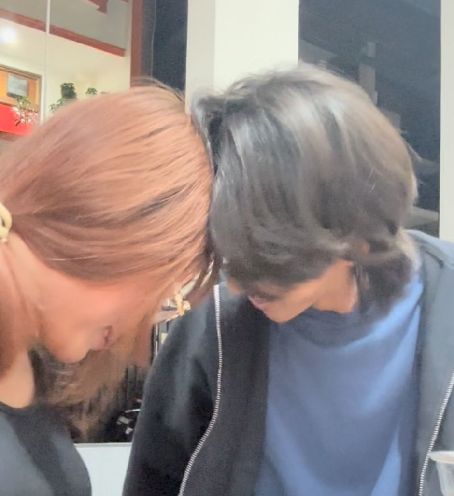

# Website Monthaniversary - Setup Guide

## 📁 Struktur Folder
```
Love/
├── index.html          (File utama website)
├── styles.css          (Styling website)
├── script.js           (Logika JavaScript)
├── music/              (Folder untuk file musik)
│   ├── song1.mp3      (Anak Kampung Lifestyle Rockstar - Poris)
│   ├── song2.mp3      (Runnin Home to You)
│   └── song3.mp3      (Send Me - Sam Cooke)
└── images/             (Folder untuk foto-foto)
    ├── photo1.jpg
    ├── photo2.jpg
    ├── photo3.jpg
    ├── photo4.jpg
    └── photo5.jpg
```

## 🎵 Cara Menambahkan Musik

1. Download atau siapkan file musik dengan judul:
   - **Anak Kampung Lifestyle Rockstar** by Poris
   - **Runnin Home to You**
   - **Send Me** by Sam Cooke

2. Convert file musik ke format MP3 jika belum

3. Rename file musik menjadi:
   - `song1.mp3` untuk Anak Kampung
   - `song2.mp3` untuk Runnin Home to You
   - `song3.mp3` untuk Send Me

4. Copy ketiga file musik ke folder `music/`

## 🖼️ Cara Menambahkan Foto

1. Siapkan 5 foto kenangan kalian berdua

2. Rename foto menjadi:
   - `photo1.jpg` (atau .png)
   - `photo2.jpg`
   - `photo3.jpg`
   - `photo4.jpg`
   - `photo5.jpg`

3. Copy kelima foto ke folder `images/`

4. Buka file `index.html` dan ganti bagian placeholder image dengan foto asli:

   Cari bagian ini (sekitar baris 78-94):
   ```html
   <div class="slide active">
       <div class="placeholder-image">📷 Photo 1</div>
   </div>
   ```

   Ganti menjadi:
   ```html
   <div class="slide active">
       
   </div>
   ```

   Lakukan untuk semua 5 foto!

## 🎮 Cara Menggunakan Website

### Login:
- **Nama**: Bisa diisi apa saja
- **Password**: `20` (tanggal jadian)

### Game:
- Match 6 pasang gambar dalam waktu 3 menit
- Klik kartu untuk membalik
- Cocokkan gambar yang sama

### Reward:
Setelah menang, ada 3 menu:
- **🖼️ Gallery**: Slideshow foto kalian
- **🎵 Music**: Playlist lagu special
- **💫 Wishes**: Ucapan dan harapan

## 🚀 Cara Membuka Website

### Opsi 1: Buka Langsung
1. Klik kanan file `index.html`
2. Pilih "Open with" → Browser favorit (Chrome/Edge/Firefox)

### Opsi 2: Live Server (Recommended)
1. Install extension "Live Server" di VS Code
2. Klik kanan `index.html`
3. Pilih "Open with Live Server"

## 🎨 Fitur Website

✅ Tema baby pink yang cute
✅ Halaman login dengan password validation
✅ Game matching picture (3 menit)
✅ Slideshow foto gallery
✅ Music player dengan 3 lagu
✅ Halaman wishes
✅ Responsive (mobile & laptop)
✅ Animasi smooth
✅ Design modern dan cantik

## 💝 Tips

- Pastikan nama file musik dan foto sesuai dengan yang di code
- Untuk hasil terbaik, gunakan foto dengan ukuran yang sama
- File musik sebaiknya format MP3
- Test di mobile dan laptop untuk memastikan responsive

## ❤️ Selamat Monthaniversary!

Semoga Hans Christian suka dengan website ini! 🎀
